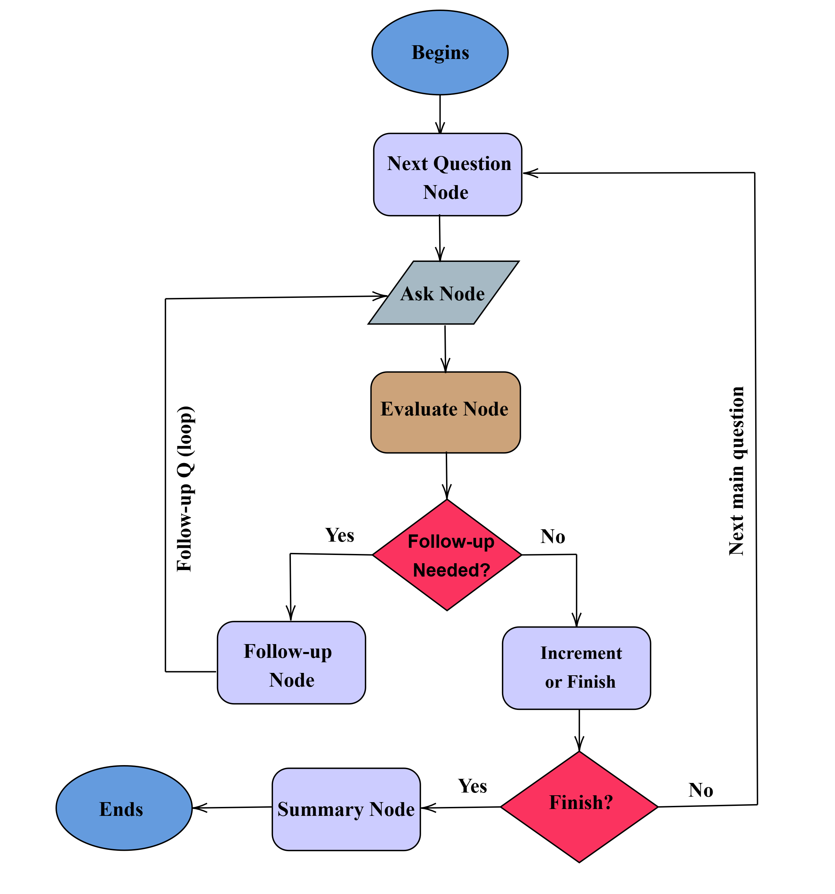

# AI Interviewer CLI (LangGraph + Ollama)

An AI-powered technical interviewer that dynamically generates questions, evaluates answers, and provides detailed feedback.  
Built using **Python**, **LangGraph** and **Ollama** for local LLM inference.

---

## 📌 Features

✅ Simulates a short, topic-focused technical interview  
✅ Dynamically generates 3–5 relevant questions from selected topics  
✅ Branching follow-up questions for weak or incorrect answers  
✅ Scores answers on **accuracy, clarity, and depth**  
✅ Provides a detailed **summary and feedback** at the end  
✅ Uses **LangGraph** for flow control and branching logic

---

## Prerequisites

- Python >= 3.10
- Virtual environment recommended (`venv` or `conda`)
- **Ollama installed** → [Installation Guide](https://ollama.com/docs)
- A supported model pulled in Ollama (e.g., `mistral` or `llama2`):

```bash
ollama pull mistral
```

## Installation

### Clone the repository:

```bash
git clone https://github.com/subhadeeppaul/ai-interviewer.git
cd ai-interviewer
```

## Setup Environment and Dependencies

### Create and activate a virtual environment

```bash
python -m venv .venv
.venv\scripts\activate
```

## Install Python Dependencies

```bash
pip install -r requirements.txt
```

## Install and Configure Ollama Environment

```bash
ollama pull mistral
$env:OLLAMA_MODEL="mistral"
setx OLLAMA_MODEL "mistral"
```

## Usage

Run the CLI interview:

```bash
python -m src.app interview --topic "Machine Learning" --difficulty easy --questions 4 --type mixed --stdin
```

## Parameters

| Parameter    | Description                                                | Example                        |
| ------------ | ---------------------------------------------------------- | ------------------------------ |
| --topic      | Topic of interview questions                               | "Machine Learning"             |
| --topics     | Comma-separated topics (rotates across them)               | "Python,JavaScript"            |
| --difficulty | Difficulty level of questions (easy, medium, hard, mixed)  | mixed                          |
| --questions  | Number of main questions (follow-ups not counted)          | 4                              |
| --type       | Question type (coding, theory, design, debugging, mixed)   | mixed                          |
| --stdin      | Enables manual multi-line input (finish with a blank line) | (present for CLI input)        |
| --log-json   | Save the final interview state to a JSON file              | runs/demo_20250908_120101.json |

### Example Command

```bash
python -m src.app interview --topic "Python" --difficulty mixed --questions 3 --type coding --stdin --log-json runs/demo.json

```

## How It Works

- **Next Question Node:** Rotates topics, balances difficulty (if mixed), avoids duplicates; prefers seeded question → falls back to LLM.
- **Ask Node:** Shows the question and captures user input.
- **Evaluate Node:** Scores with LLM on accuracy, clarity, depth, overall.

  - _Heuristics: very short answers or no token overlap with the question can force a follow-up._

- **Follow-up Node:** Generates a focused follow-up if needed.

  - Limited by `MAX_FOLLOWUPS_PER_Q` per main question

- **Increment/Finish Node:** Tracks progress and moves to the next main question or finishes the interview.
- **Summary Node:** Prints the interview summary:
  - Topics covered
  - Scores per topic
  - Strengths
  - Recommendations

## Optional Features

- **Answer Scoring:** Evaluates accuracy, clarity, depth, overall

## Branching Flow

Below is the branching logic used in the interview process, implemented with LangGraph:



### Example Run

```bash
$ python -m src.app interview --topic "Machine Learning" --difficulty easy --questions 2 --type mixed --stdin
```

### Example Output

```text
Question 1 of 2 (Topic: Machine Learning, Difficulty: easy)
[Q] Can you explain supervised vs unsupervised learning?
Your answer (blank line to finish): Labelled data vs unlabelled data

→ Scores: accuracy=2.0, clarity=6.0, depth=3.0, overall=3.67
→ Rationale: Partially correct explanation; examples missing.
→ Follow-up flagged.

[Q] (Follow-up) Could you elaborate with concrete examples?
Your answer (blank line to finish): Clustering for unsupervised, regression for supervised

→ Scores: accuracy=6.0, clarity=7.0, depth=5.0, overall=6.0
→ Rationale: Examples provided, explanation improved.

```
